**Rocket BLACKBOX** is an open-source avionics and environmental flight data recorder (FDR) designed for model rocketry and sounding rocket payloads.

Built around the **RAK3112** module (Espressif ESP32-S3 + Semtech SX1262 LoRa), the board carries a multi-sensor array across two independent I2C buses, a 4-bit SDMMC slot for high-rate flight logging, multi-constellation GNSS with a 1PPS hardware timing line, long-range digital telemetry, and a push-button soft-latch power circuit with USB battery management.

### Source files: [rambros3d/Rocket_BlackBox](https://github.com/rambros3d/Rocket_BlackBox)

- Firmware: [`arduino`](https://github.com/rambros3d/Rocket_BlackBox/tree/main/test_firmware)
- 3D Model: [`fusion360`](https://a360.co/47nZXGg)
- PCB: [`oshwlab`](https://oshwlab.com/shreeramlive/project_dmtpicmk)

---

## Mission: DSRSLV (SINSME Foundation)
 
Rocket BlackBox is developed for the **DSRSLV** sounding rocket initiative, spearheaded by the **[SINSME Foundation](https://www.sinsmefoundation.org)**.

The **DSRSLV Phase 2 (P2)** mission aims for an apogee of approximately 5 km, carrying student atmospheric payloads and flight instrumentation to foster hands-on space science and aerospace education.

**Mission Details:** [SINSME Foundation DSRSLV Project](https://www.sinsmefoundation.org/general-7-1)

---

## Sensor Data & Measurement Capabilities

Sensors are split across two I2C buses, an internal SPI bus for LoRa RF telemetry, and a dedicated GNSS UART.

| Primary Role | Data Types | Hardware Interface |
|---|---|---|
| **Barometric Altimeter**<br><small>MS5607</small> | **Barometric Pressure:** 10 to 1200 hPa (Resolution: 0.01 hPa / ~20 cm altitude, 24-bit $\Delta\Sigma$ ADC, factory PROM calibration with CRC4 checksum)<br>**Temperature:** −40°C to +85°C (Resolution: < 0.01°C, Accuracy: ±1.0°C) | I2C Bus 1<br>`0x77` |
| **CO2, Temperature & Humidity**<br><small>Sensirion SCD40</small> | **CO2 Concentration:** 400 to 5000 ppm (Resolution: 1 ppm, Accuracy: ±(40 ppm + 5% of reading))<br>**Temperature:** −10°C to +60°C (Resolution: 0.01°C, 16-bit, Accuracy: ±0.8°C)<br>**Relative Humidity:** 0% to 100% RH (Resolution: 0.01% RH, 16-bit, Accuracy: ±6% RH) | I2C Bus 1<br>`0x62` |
| **VOC & NOx Gas Index**<br><small>Sensirion SGP41</small> | **VOC Gas Index:** 1 to 500 (16-bit raw ticks, limit < 1 to 1000 ppm VOC)<br>**NOx Gas Index:** 1 to 500 (16-bit raw ticks, detection limit 0.05 to 10 ppm NO2)<br>**Compensation:** Accepts external humidity and temperature for baseline drift correction | I2C Bus 1<br>`0x59` |
| **Ambient & Solar Illuminance**<br><small>TSL25911FN</small> | **Dual Optical Channels:** CH0 Full Spectrum (300–1100 nm) & CH1 Infrared (500–1100 nm)<br>**Dynamic Range:** 600,000,000:1 (188 µlux up to 88,000 lux, 16-bit ADC)<br>**Programmable Gain:** 1×, 25×, 428×, 9876× with 100–600 ms integration timing | I2C Bus 1<br>`0x29` (Device ID: `0x50`) |
| **UV Index & Ambient Light**<br><small>LTR-390UV-01</small> | **Ambient Light (ALS):** 0.01 to 64,000 lux (spectral peak 550 nm, photopic human eye response)<br>**UV Spectrum:** UVA / UVB (280–400 nm), 13 to 20-bit resolution, UV Index 0 to 12+ | I2C Bus 1<br>`0x53` |
| **9-DOF IMU & Attitude**<br><small>Bosch BNO055</small> | **Accelerometer:** ±2g to ±16g (14-bit, 3 axes)<br>**Gyroscope:** ±125°/s to ±2000°/s (16-bit, 3 axes)<br>**Magnetometer:** ±1300 µT (X, Y), ±2500 µT (Z) (16-bit, 0.3 µT resolution, 3 axes)<br>**Sensor Fusion:** On-chip ARM Cortex-M0 coprocessor outputs quaternions (w, x, y, z) and Euler angles (0–360° @ 0.0625°) | I2C Bus 2<br>`0x28` |
| **GNSS & Time Sync**<br><small>Beitian BE-166</small> | **Position & Velocity:** GPS, Galileo, BeiDou, QZSS - 2.0 m CEP horizontal, 0.05 m/s velocity, up to 50,000 m altitude<br>**1PPS Timing:** Hardware pulse, 20 ns RMS | UART (115200 baud)<br>Hardware 1PPS line (`GPIO 38`) |
| **Auxiliary Environmental**<br><small>Bosch BME680</small> | **Barometric Pressure:** 300 to 1100 hPa (Resolution: 0.18 Pa / ~17 cm, Accuracy: ±0.12 hPa)<br>**Temperature & Humidity:** −40°C to +85°C (Resolution: 0.01°C), 0% to 100% RH (Resolution: 0.008% RH)<br>**Gas Resistance:** 10 Ω to 60 MΩ MOX sensor for bVOC detection | I2C Bus 1<br>`0x76` |
| **LoRa RF Telemetry & Link**<br><small>Semtech SX1262 (RAK3112)</small> | **Frequency:** 868.000 MHz (HF Band)<br>**Modulation:** LoRa (BW: 125 kHz, SF7, CR 4/5, Sync: `0x12`, 16 Preamble, CRC on)<br>**RF Performance:** +22 dBm max TX power, −125 dBm sensitivity, DIO2 RF switch, TCXO 1.6V oscillator<br>**Data Rate & Latency:** ~5.47 kbps over-the-air, ~226 ms RTT bidirectional ping-pong, 0.0% packet loss tested | Internal SPI Bus<br>(SCK=5, MISO=3, MOSI=6, NSS=7, RST=8, BUSY=48, DIO1=47, ANT_SW=4) |

---

## Circuit & Hardware Subsystems

The schematic is organized as one modular block per subsystem. Environmental sensors share one I2C bus, the IMU has its own dedicated I2C bus, GNSS uses UART plus a hardware timing line, and logging uses 4-bit SDMMC.

### RAK3112 MCU + LoRa Module

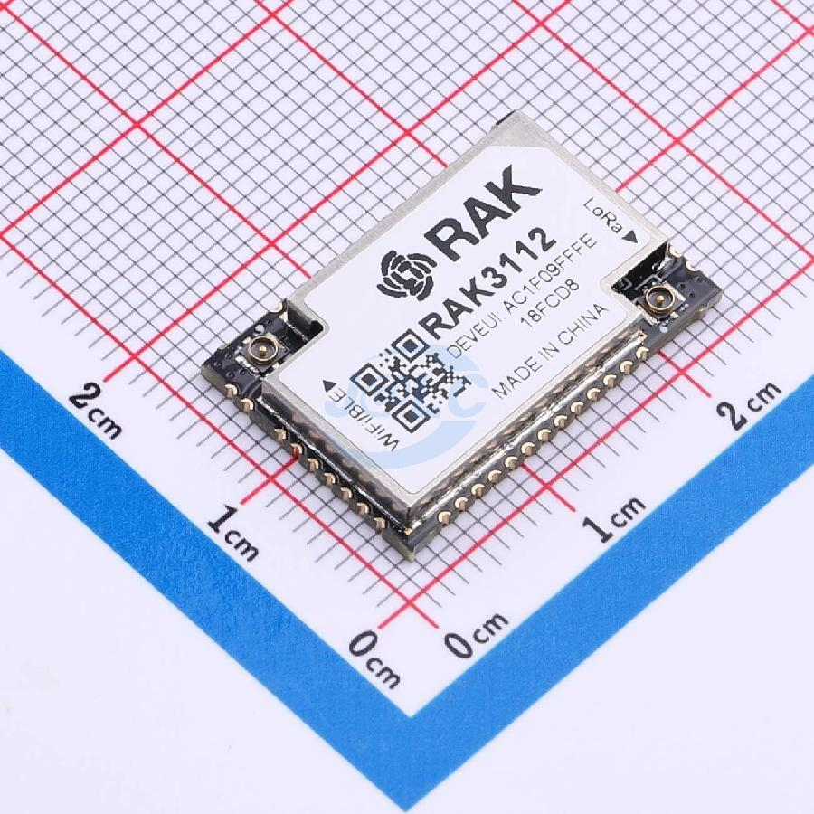

Central controller combining an ESP32-S3 dual-core microcontroller with an integrated Semtech SX1262 LoRa transceiver. It hosts the USB connection, both I2C buses, the GNSS UART, the SDMMC interface, and the RF telemetry frontend. The internal SX1262 links via internal SPI with TCXO frequency stabilization powered at 1.6V (DIO3) and an active RF switch powered by GPIO 4. Dedicated buttons handle boot-mode entry and reset, a resistor divider feeds battery voltage to the ADC for monitoring, and separate lines hold power on, sense the power button, and drive the status LED.

**Ground Station Integration:** The payload links wirelessly to a compact **Waveshare USB-to-LoRa-HF (TCXO)** dongle flashed with custom KISS TNC modem firmware (GD32F103 MCU). Over-the-air communication operates at 868.000 MHz with full-duplex CSMA bypass for rapid packet turnaround (~226 ms round-trip ping-pong, 0.0% packet loss).

### Charger & Power Control Circuit

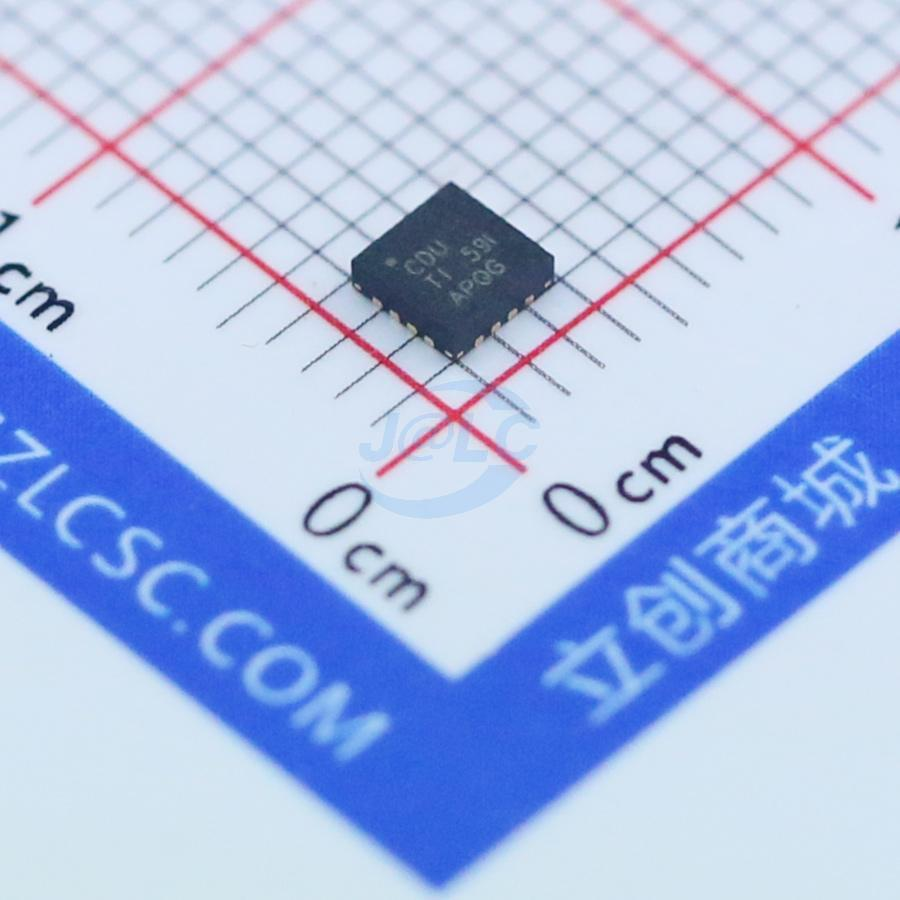

Built around the BQ24075 LiPo charger with power-path management, so the board runs from USB when present and seamlessly falls back to battery. Charge and power-good LEDs show charger state. A dual-MOSFET push-button soft-latch holds the charger output enabled after the button is released; the MCU keeps itself powered through a hold line and can shut the board down by releasing it. A manual cutoff switch fully disconnects the battery, and a divided-down tap of the button lets the MCU detect presses.

### Voltage Regulator

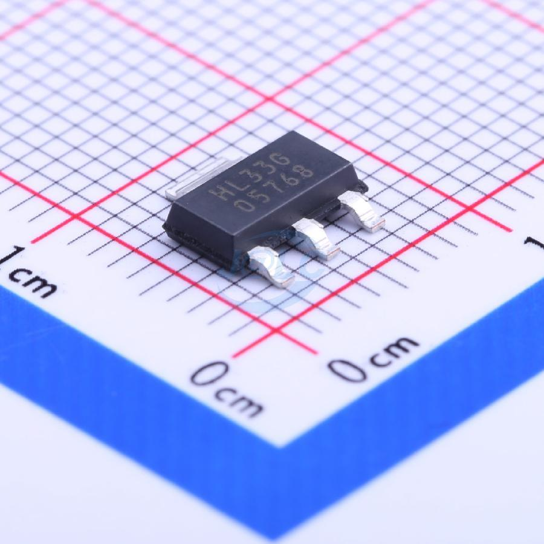

A 3.3 V LDO that powers the MCU, sensors, GNSS, and SD card from the charger output, keeping noisy supply switching away from the analog sensor rails.

### SD Card

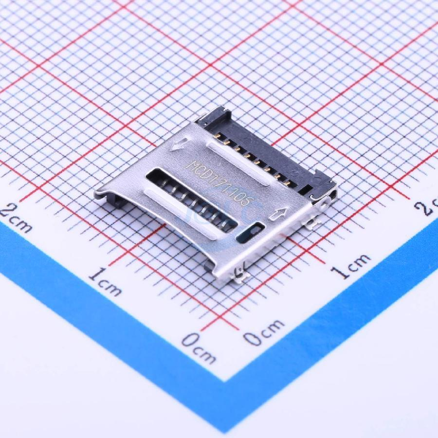

MicroSD slot wired in 4-bit SDMMC mode for high-speed flight logging, with pull-ups on clock, command, and all four data lines.

### GNSS Receiver

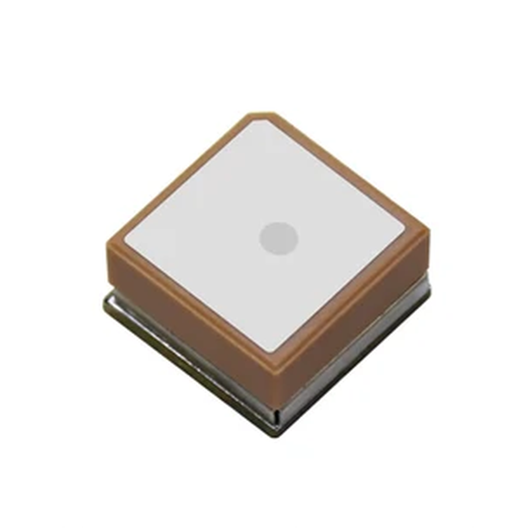

Beitian multi-constellation receiver with integrated antenna. It streams position over UART and provides a hardware 1-pulse-per-second output for precise time synchronization. Pin headers break out the serial and timing signals.

### 9-Axis IMU Sensor

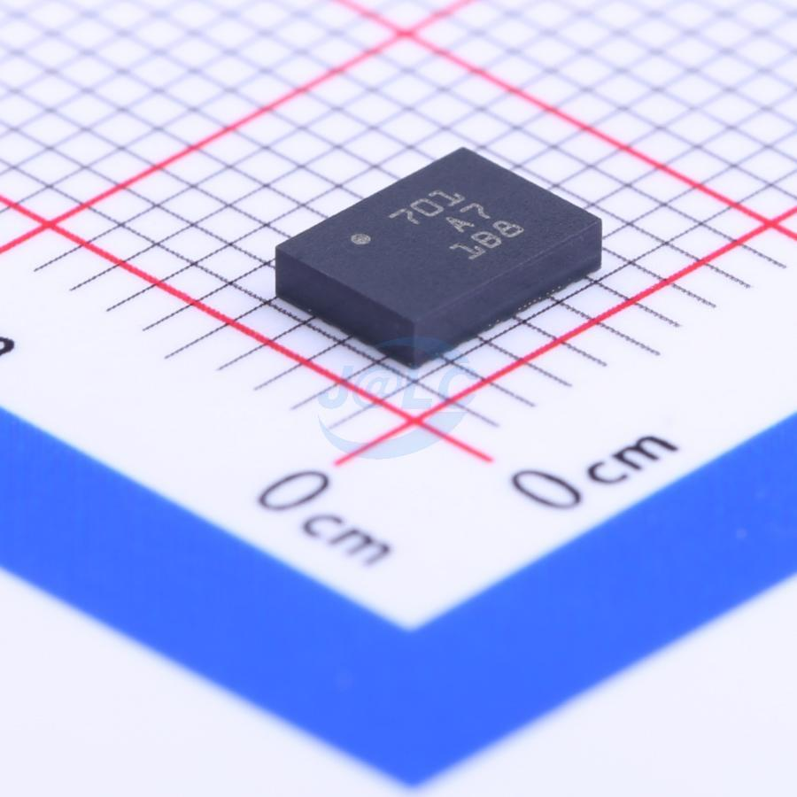

BNO055 with on-chip sensor fusion outputting absolute orientation as quaternions and Euler angles. It sits alone on the second I2C bus to avoid address conflicts with the environmental sensors, with a separate interrupt line for motion and data-ready events.

### Humidity, Temperature & Pressure Sensor

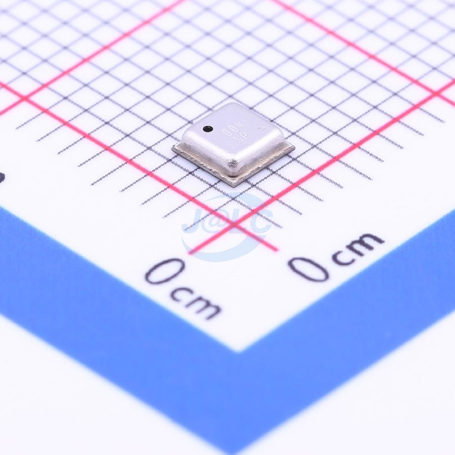

BME680 auxiliary environmental sensor for pressure, temperature, humidity, and gas resistance.

### Altitude Sensor

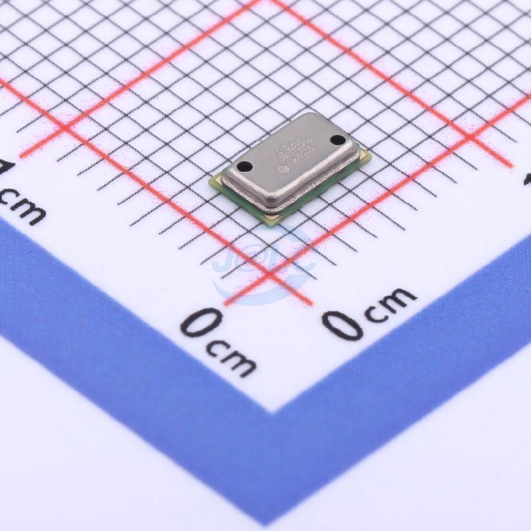

MS5607 barometric pressure and temperature sensor used as the primary altimeter, strapped for I2C operation.

### CO2 Sensor

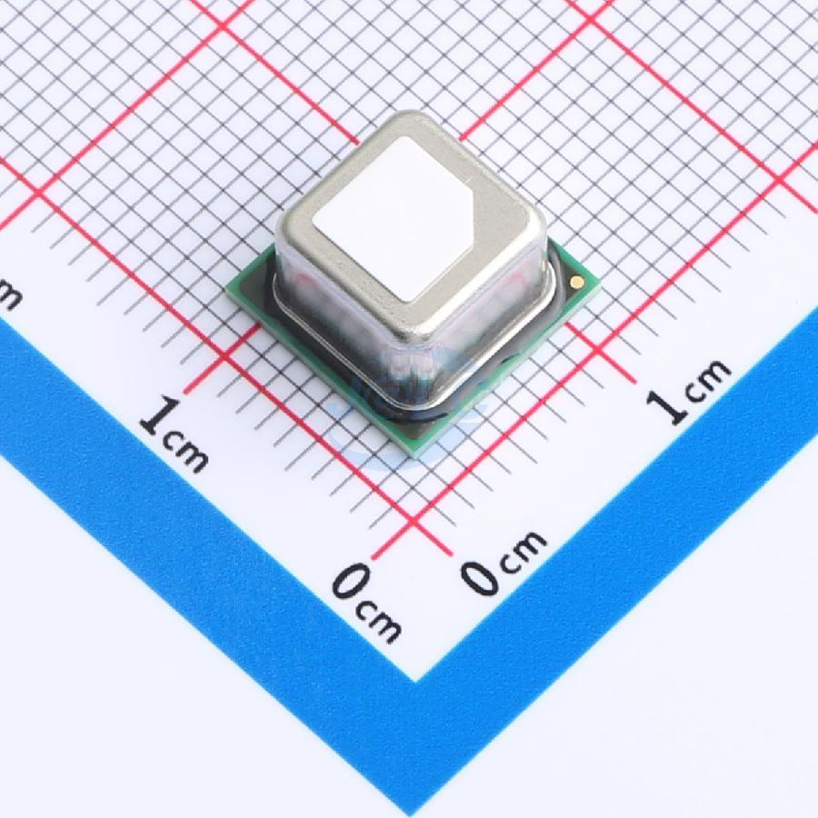

SCD40 photoacoustic CO2 sensor, also reporting temperature and relative humidity. Its core and heater supplies are tied together for 3.3 V operation as recommended for this use.

### VOC & NOx Sensor

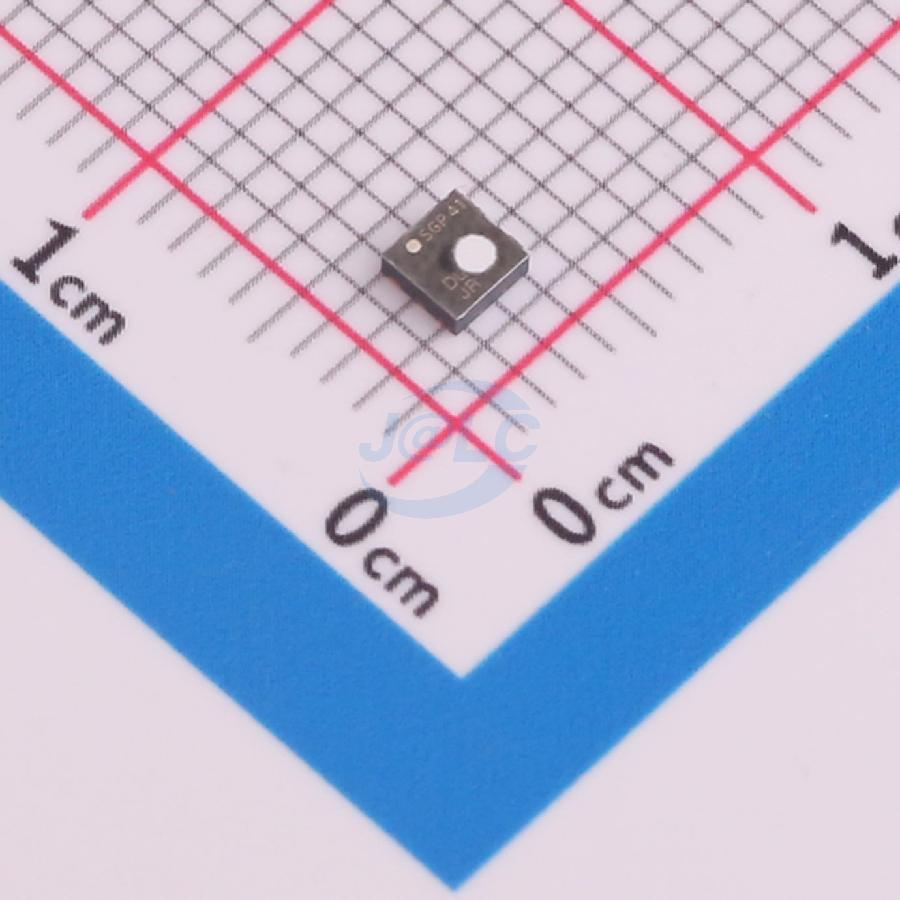

SGP41 metal-oxide gas sensor reporting VOC and NOx indices. Requires temperature and humidity compensation from the other sensors to correct baseline drift.

### Ambient Light Sensor

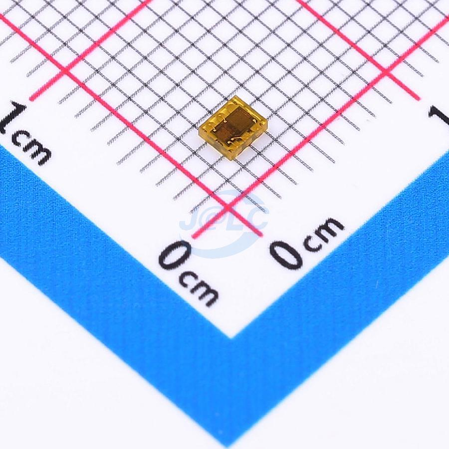

TSL25911FN dual-diode sensor measuring full-spectrum and infrared light separately so visible illuminance can be derived.

### UV Sensor

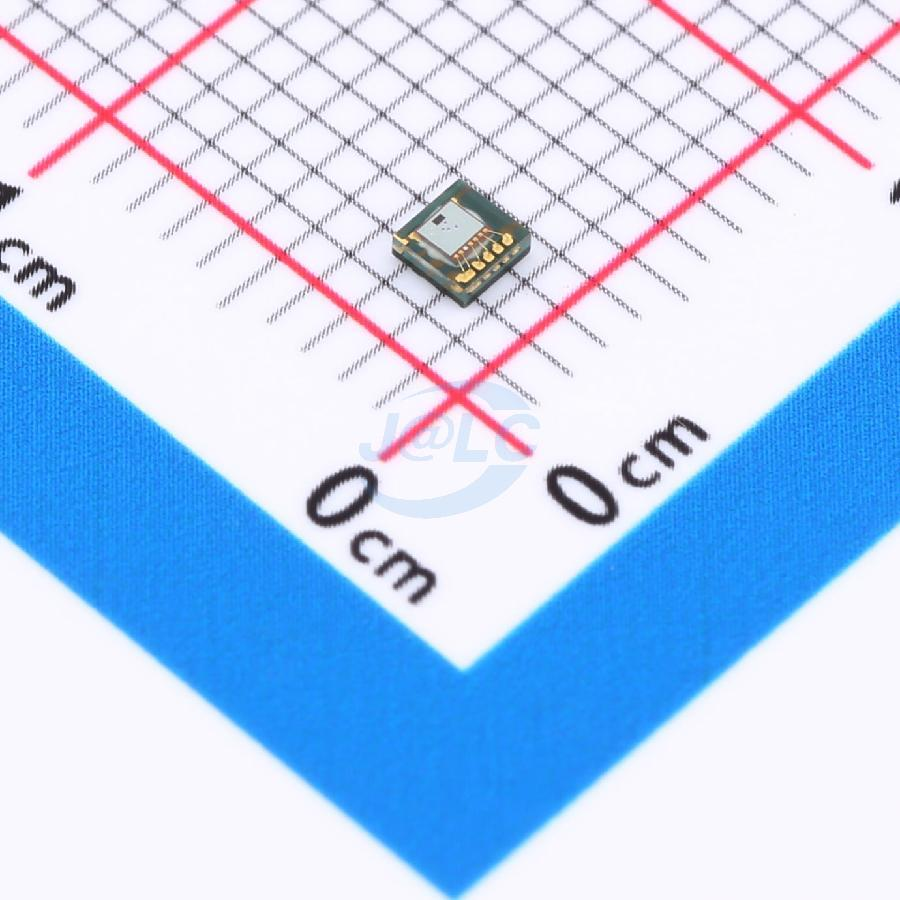

LTR-390 sensor measuring UVA/UVB for UV index plus ambient visible light, with an interrupt output for threshold events.

---

## Pin Mapping

| MCU Pin | Sensor Pin | Description |
|---|---|---|
| **Power & Housekeeping** | | |
| **GPIO 40** | `PWR_EN` | Power hold latch output. Driven HIGH by MCU to maintain DC-DC / LDO power alive; pulled LOW to shut down. |
| **GPIO 39** | `PUSH_SW` | Push-button state detection input. Reads user button clicks after power-on. |
| **GPIO 9** | `VADC` | Battery voltage monitor (ADC1 Channel 8, 1/2 resistor divider 5.1 kΩ / 5.1 kΩ). |
| **GPIO 45** | `LED` | Active-high status and heartbeat LED indicator. |
| **I2C Bus 1 - Environmental & Optical Sensors** | | |
| **GPIO 10** | `SDA1` | Environmental I2C Bus 1 serial data line (connected to MS5607, SCD40, SGP41, TSL25911FN, LTR-390, BME680 with 2.2 kΩ pull-up to 3.3V). |
| **GPIO 11** | `SCL1` | Environmental I2C Bus 1 serial clock line (connected to MS5607, SCD40, SGP41, TSL25911FN, LTR-390, BME680 with 2.2 kΩ pull-up to 3.3V). |
| **I2C Bus 2 - Inertial Navigation (BNO055)** | | |
| **GPIO 2** | `SDA2` | Inertial navigation I2C Bus 2 serial data line for BNO055 (with 2.2 kΩ pull-up to 3.3V). |
| **GPIO 1** | `SCL2` | Inertial navigation I2C Bus 2 serial clock line for BNO055 (with 2.2 kΩ pull-up to 3.3V). |
| **GPIO 4** | `INT` | Hardware motion detection and data-ready interrupt line from BNO055. |
| **GNSS - Beitian BE-166** | | |
| **GPIO 42** | `GNSS_TXD` | UART receiver input (MCU RX) listening to multi-constellation NMEA and UBX stream at 115200 baud from BE-166. |
| **GPIO 41** | `GNSS_RXD` | UART transmitter output (MCU TX) driving bidirectional UBX/NMEA configuration and query commands to BE-166. |
| **GPIO 38** | `GNSS_IPPS` | Microsecond-accurate hardware 1 pulse-per-second (1PPS) synchronization interrupt line from BE-166. |
| **MicroSD - 4-Bit SDMMC Interface** | | |
| **GPIO 14** | `CLK` | High-speed 4-bit parallel SDMMC clock line. |
| **GPIO 21** | `CMD` | High-speed 4-bit parallel SDMMC command and response line (with 10 kΩ pull-up to 3.3V). |
| **GPIO 13** | `DAT0` | High-speed 4-bit parallel SDMMC data line bit 0 (with 10 kΩ pull-up to 3.3V). |
| **GPIO 12** | `DAT1` | High-speed 4-bit parallel SDMMC data line bit 1 (with 10 kΩ pull-up to 3.3V). |
| **GPIO 17** | `DAT2` | High-speed 4-bit parallel SDMMC data line bit 2 (with 10 kΩ pull-up to 3.3V). |
| **GPIO 18** | `DAT3` / `CD` | High-speed 4-bit parallel SDMMC data line bit 3 / card detection (with 10 kΩ pull-up to 3.3V). |
| **LoRa Transceiver - Semtech SX1262 (RAK3112 Internal)** | | |
| **GPIO 5** | `LORA_SCK` | Internal SPI clock line for SX1262. |
| **GPIO 3** | `LORA_MISO` | Internal SPI Master-In-Slave-Out line for SX1262. |
| **GPIO 6** | `LORA_MOSI` | Internal SPI Master-Out-Slave-In line for SX1262. |
| **GPIO 7** | `LORA_NSS` | Internal SPI Slave Select (Active Low) for SX1262. |
| **GPIO 8** | `LORA_RST` | Hardware active-low reset line for SX1262. |
| **GPIO 48** | `LORA_BUSY` | Hardware BUSY status line from SX1262 (monitored prior to SPI commands). |
| **GPIO 47** | `LORA_DIO1` | Multi-purpose packet RX / TX done interrupt line from SX1262. |
| **GPIO 4** | `LORA_ANT_SW` | RF Antenna Switch power gate (driven HIGH to activate RF frontend). |

---

## Workarounds

During hardware bring-up and bench testing of the Rev 1.0 PCB, the onboard Bosch ICs did not work:

- **Bosch BNO055 (9-DOF IMU):** The `nRESET` pin (Pin 11) was left unconnected / floating as per the datasheet. Maybe the internal weak pull-up is insufficient to overcome the floating state, the internal processor failed to respond (NACK) over I2C.
- **Bosch BME680 (Auxiliary Environmental Sensor):** This one suffered a hard physical short between the SDA1 line and GND, requiring physical isolation via removal of its 0Ω series resistor.

### External IMU Workaround
- To bypass the onboard IC issues and restore full 9-DOF inertial and attitude sensing for flight, an **external BNO055 module** was connected to the system as a hardware workaround.
- Environmental data acquisition is handled by the primary MS5607 altimeter, Sensirion SCD40, and SGP41 sensors.

---

## LoRa RF Telemetry Link & Ground Station Verification

The avionics system features long-range digital telemetry enabling real-time flight monitoring, apogee confirmation, GPS tracking, and recovery beaconing.

### RF Modulation & Architecture

| Parameter | Operational Setting |
|---|---|
| **Carrier Frequency** | `868.000 MHz` (HF Band, matched across payload and ground station) |
| **Modulation** | LoRa (Bandwidth: `125.0 kHz`, Spreading Factor: `SF7`, Coding Rate: `4/5`) |
| **Sync Word** | `0x12` (MeshCore / RadioLib standard) |
| **Preamble Length** | `16 symbols` with hardware CRC enabled |
| **Oscillator Stability** | TCXO (Temperature Compensated Crystal Oscillator) enabled on both nodes (1.6V on SX1262 DIO3) |
| **Ground Receiver** | Waveshare USB-to-LoRa-HF (TCXO) dongle with GD32F103 MCU running custom KISS TNC firmware |

### Hardware Verification & Benchmark Results

Over-the-air communication was validated in live bidirectional tests between the rocket payload and the Waveshare ground station receiver:

- **Packet Loss:** **0.00%** (50/50 consecutive downlink telemetry packets captured; 10/10 bidirectional ping-pong frames verified).
- **Round-Trip Turnaround (RTT):** **216 ms – 226 ms** average full-duplex ping-pong latency.
- **Signal Quality:** RSSI of **−40.5 dBm** with SNR of **+12.6 dB** (> 20 dB above the SX1262 SF7 demodulation limit), proving a clear link with zero symbol slippage.
- **Effective Data Rate:** ~5.47 kbps physical over-the-air bitrate; supports flight telemetry streaming at 2 to 5 Hz.

### Quick Guide: Flashing & Operating the Waveshare USB-to-LoRa Adapter

To interface the **[Waveshare USB-to-LoRa-HF](https://www.waveshare.com/wiki/USB-TO-LoRa-HF)** adapter with the Rocket BlackBox payload, the stock AT-command firmware must be replaced with the open-source **[MeshCore KISS TNC firmware](https://github.com/neohiro/meshcore-waveshare-usb-lora)**. This gives direct byte-level RF control, standard KISS framing, and low-latency packet streaming via USB serial.

#### Useful References & Repositories
- **Firmware Repository:** [neohiro/meshcore-waveshare-usb-lora](https://github.com/neohiro/meshcore-waveshare-usb-lora)
- **Waveshare Hardware Wiki:** [Waveshare USB-to-LoRa-HF Product Documentation](https://www.waveshare.com/wiki/USB-TO-LoRa-HF)
- **Flashing Tool:** [pyOCD Python SWD Debugger](https://pyocd.io/) or [OpenOCD](https://openocd.org/)
- **Payload Radio Library:** [jgromes/RadioLib](https://github.com/jgromes/RadioLib)

#### Step 1: Hardware Connections (ST-Link V2 SWD)

Open the plastic casing of the Waveshare dongle to access the 4-pin SWD programming header on the PCB:
The bottom cover seems to be stuck with the PCB so I didnt remove that.

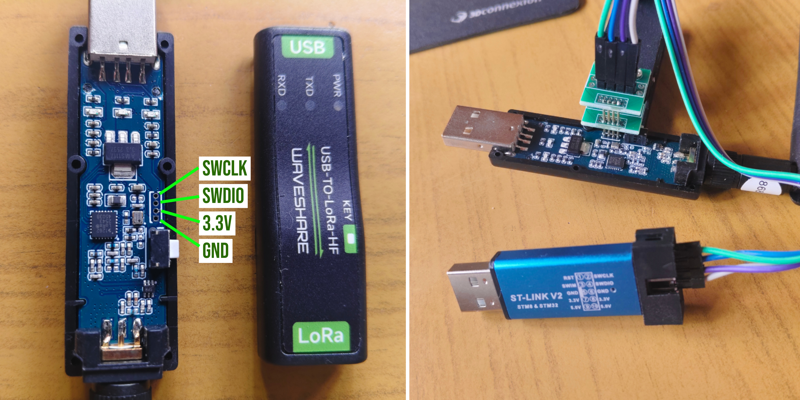

#### Step 2: Compile Firmware with TCXO Enabled

Clone the [meshcore-waveshare-usb-lora](https://github.com/neohiro/meshcore-waveshare-usb-lora) repository with submodules:

```bash
git clone --recurse-submodules https://github.com/neohiro/meshcore-waveshare-usb-lora.git
cd meshcore-waveshare-usb-lora/firmware
```

Build the binary with the `WITH_TCXO=1` build flag to activate MCU pin `PD1` which powers the SX1262 TCXO crystal:

```bash
make WITH_TCXO=1 clean
make WITH_TCXO=1
```

This generates `firmware.bin` linked for flash base address `0x08000000`.

#### Step 3: Flash the GD32F103 MCU

Flash the compiled firmware using [pyOCD](https://pyocd.io/) targeting the STM32F103/GD32F103 core:

```bash
# Install pyOCD (if not already installed)
pip install pyocd

# Probe MCU target via connected ST-Link V2
pyocd list

# Erase and program flash memory at 0x08000000
pyocd flash -t stm32f103c8 -a 0x08000000 firmware.bin
```

Disconnect the ST-Link and plug the dongle directly into the host PC's USB port (enumerates as `/dev/ttyACM0` via the onboard CH343 USB-to-UART bridge).

#### Step 4: Real-Time Telemetry & Link Testing

Run the telemetry receiver or test scripts from the repository's `flight_dashboard/` directory:

```bash
# 1. Run live ground telemetry receiver & CSV logger:
python flight_dashboard/lora_ground_receiver.py --port /dev/ttyACM0 --log flight_log.csv

# 2. Run automated bidirectional ping-pong test against payload:
python flight_dashboard/test_rf_ping_pong.py
```

---

## EasyEDA Educator Program

[](https://easyeda.com/)

This project's PCB design, fabrication, and PCBA assembly were generously sponsored by the **[EasyEDA Educator Program](https://easyeda.com/)** and fabricated by **[JLCPCB](https://jlcpcb.com/)**.
