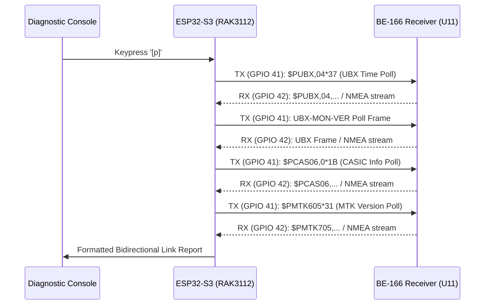

# Design: GPS Bidirectional Command Link Verification

## Architecture & Protocol Flow

The Rocket BlackBox payload PCB connects the MCU TX pin (`GPIO_NUM_41`) to the BE-166 GNSS receiver RXD pin (`U11 Pin 1`) across header `H1`/`H2`. To confirm bidirectional communication, the firmware sends structured query strings over `HardwareSerial` and monitors incoming bytes within isolated time windows.

## Protocol Probes

1. **UBX Protocol:**
   - `$PUBX,04*37\r\n`: Polls UTC time and date from u-blox compatible cores.
   - `$PUBX,00*33\r\n`: Polls current position and satellite status.
   - `\xB5\x62\x0A\x04\x00\x00\x0E\x34`: Binary UBX `MON-VER` query.
2. **CASIC Protocol (AT6558/AT6558R):**
   - `$PCAS06,0*1B\r\n`: Queries hardware model, firmware version, and manufacturer string.
   - `$PCAS03,0*1E\r\n`: Queries active constellation configuration.
3. **MediaTek Protocol (MT3333):**
   - `$PMTK605*31\r\n`: Queries release firmware version.

## Link Validation Criteria
- If the receiver acknowledges or answers any proprietary query (PUBX, PCAS, or PMTK), bidirectional TX/RX is 100% confirmed, and the baseband chipset family is positively identified.
- Even if the receiver firmware runs in strict output-only NMEA mode, transmitting characters while receiving NMEA confirms there is no bus contention or grounding on GPIO 41.
